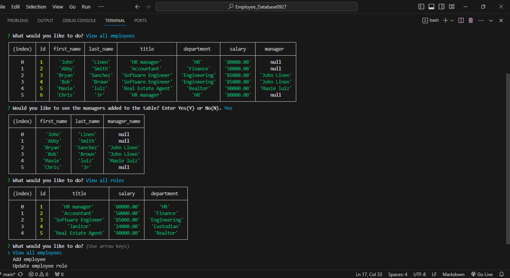
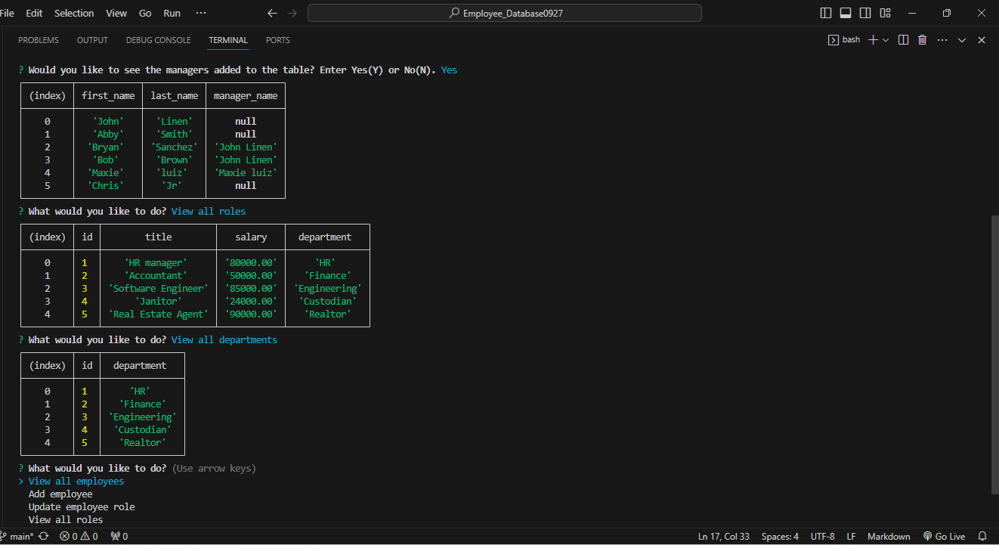

# 12 SQL: Employee_DataBase0927

GitHub Repo: https://github.com/Ariesscode/Employee_Database0927


## Your Task
This project was to create an application for a business owner that wants to be able to manage the business database. This application uses the "CRUD" layout, which enables the business owner to create, read, updatea and delete data from a database that holds the business data. The database platform used in this application is MYSQL. [MySQL2 package](https://www.npmjs.com/package/mysql2) to connect to your MySQL database and perform queries, and the [Inquirer package](https://www.npmjs.com/package/inquirer/v/8.2.4) to interact with the user via the command line. This engine enables to users to retrieve, post, save, and delete data that the user commands. Also, the schema used to build the tables are set to provide a auto increment id number, so that it makes it easier to add to the database, keeping it organized. Each prompt requires input or a chosen choice to proceed with data. If an employee does not have a manager, the table will show "NULL" for the manager name and manager id. This application uses two packages, inquirer and node to be able to prompt user of questions towards the action they may want to proceed. The user will be able to enter input and choose from choices, which will then be used to guide them to the next prompt or edit data. To run this program, each user will need to install all dependencies. The business owner or user will be able to see tables of data in which they can add an employee, role, department, manager and also view all data saved. 

## Walk-through Video 
https://drive.google.com/file/d/1gz9pXngV1vyMTgra6GDtN6OhlpvBA0M3/view

## Dependencies 

Inquirer  `npm i inquirer@8.2.4`

## Get started (Database is all ready set if you want to skip MYSQL tutorial, npm start!)
- Download/ Install all dependencies (npm i)
- Log into MYSQL (mysql -u root -p) 
- Enter password for MYSQL
- Type "source" and copy the relative path of Schema.sql file, press enter, then repeat for Seeds.sql file
- Exit the MYSQL database
- In terminal(bash) run npm start or node server.js to start program
- Follow prompts
- Click exit to exit employee database 


## User Story

```md
AS A business owner
I WANT to be able to view and manage the departments, roles, and employees in my company
SO THAT I can organize and plan my business
```

## Acceptance Criteria

```md
GIVEN a command-line application that accepts user input
WHEN I start the application
THEN I am presented with the following options: view all departments, view all roles, view all employees, add a department, add a role, add an employee, and update an employee role
WHEN I choose to view all departments
THEN I am presented with a formatted table showing department names and department ids
WHEN I choose to view all roles
THEN I am presented with the job title, role id, the department that role belongs to, and the salary for that role
WHEN I choose to view all employees
THEN I am presented with a formatted table showing employee data, including employee ids, first names, last names, job titles, departments, salaries, and managers that the employees report to
WHEN I choose to add a department
THEN I am prompted to enter the name of the department and that department is added to the database
WHEN I choose to add a role
THEN I am prompted to enter the name, salary, and department for the role and that role is added to the database
WHEN I choose to add an employee
THEN I am prompted to enter the employee’s first name, last name, role, and manager, and that employee is added to the database
WHEN I choose to update an employee role
THEN I am prompted to select an employee to update and their new role and this information is updated in the database 
```

## Mock-Up

The following video shows an example of the application being used from the command line:

[](https://2u-20.wistia.com/medias/2lnle7xnpk)






